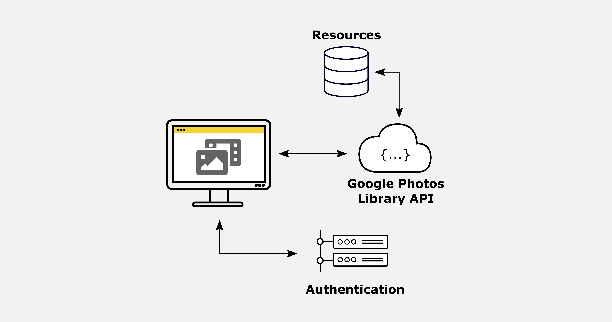

### Download Images from Google Photos using Python

Using the Google Photos REST API you can download, upload and modify images stored in Google Photos.

Just as a quick refresher, REST is an architectural style for application programming interfaces that allows interaction with RESTful web services.

A GET request allows to retrieve database entries, POST requests to create new entries, PUT requests to update an entry and DELETE requests to delete one.

The jupyter notebook describes how to set up a simple project that lets you use Python to download images from Google Photos.

## Used Libraries and Tools

* Python: 
  * requests
  * pandas
  * google-api-python-client
  * google-auth-httplib2
  * google-auth-oauthlib

## License
[MIT](https://choosealicense.com/licenses/mit/)