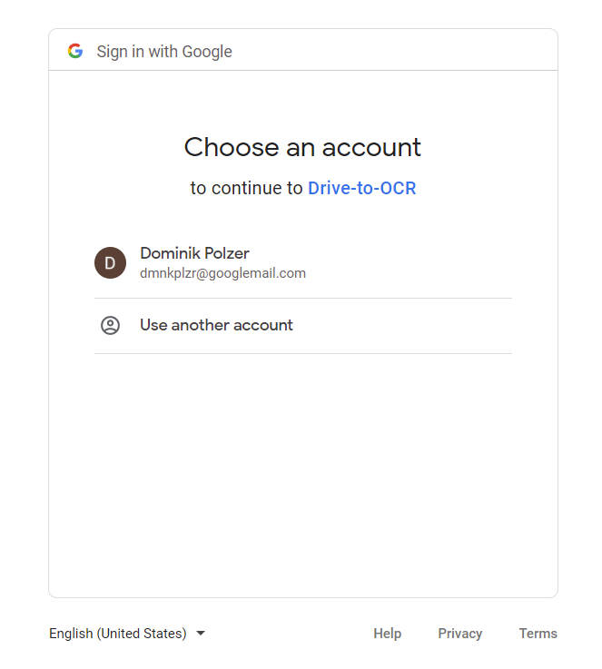

# google-photos-api
Download images from google photos using python

## Google Photos API

1. Create virtual environment venv 
``python -m venv venv``
2. Install python packages https://developers.google.com/people/quickstart/python <br>
``pip install --upgrade google-api-python-client google-auth-httplib2 google-auth-oauthlib
``
or
``pip install -r requirements.txt
``
3. Enable Google Photos API Service
   1. Go to the [Google API Console](https://console.cloud.google.com/). 
   2. From the menu bar, select a project or create a new project.
      
   3. To open the Google API Library, from the Navigation menu, select APIs & Services > Library. 
   4. Search for "Google Photos Library API". Select the correct result and click "enable". If its already enabled, click "manage"
   5. Afterwards it will forward you to the "Photos API/Service details" page (https://console.cloud.google.com/apis/credentials)

4. Create API/OAuth credentials
   1. On the left side at the Google Photos API Service page click on Credentials
   2. Click on "Create Credentials" and create a OAuth client ID
   3. As application type I am choosing "Desktop app" and give your client you want to use to call the API a name
   4. Download the JSON file to the created credentials, rename it to "client_secret.json" and save it in the folder "credentials"

5. Configure "OAuth consent screen" ([Source](https://stackoverflow.com/questions/65184355/error-403-access-denied-from-google-authentication-web-api-despite-google-acc))
   1. Go back to the Photos API Service details page and click on "[OAuth consent screen](https://console.cloud.google.com/apis/credentials/consent)" on the left side (below "Credentials") 
   2. Add a Test user: Use the email of the account you want to use for testing the API call
   

5. Use the funtions from "google_photos_api.py" to create a service for the first time:
```
from google_photos_api import GooglePhotosApi

google_photos_api = GooglePhotosApi()
service = google_photos_api.create_service()
```

6. Calling the API for the first time, 
   1. Google will ask you if you want to grant the App the required permissions you defined with the scope:
   
   2. Since its just a test app at the moment, Google will make you aware of that > Click on "Continue"
   3. Once you granted the app the required permissions, you will see a "token_......pickle" file created in the folder "credentials". This token file will be used for future calls.


**Helpful links:**

* https://www.youtube.com/watch?v=dkxcd2Q3Qwo
* https://developers.google.com/people/quickstart/python
* https://console.developers.google.com/
* https://stackoverflow.com/questions/66689941/google-photos-api-new-version 
* https://learndataanalysis.org/getting-started-with-google-photos-api-and-python-part-1/
